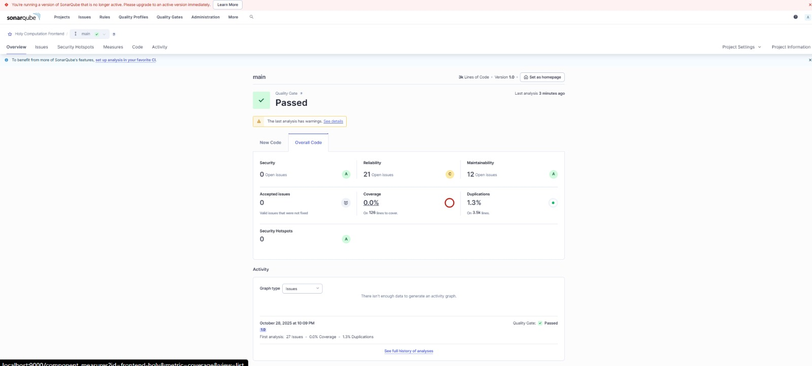

# Programaci-n-web
En este repositorio se realizarán cada uno de los ejercicios de programación web, haciendo una rama por cada ejercicio, hacinendo uso de la correcta utilización de los commits
## Análisis de calidad con SonarQube

Capturas del dashboard:

