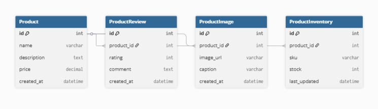

# Programaci-n-web
En este repositorio se realizarán cada uno de los ejercicios de programación web, haciendo una rama por cada ejercicio, hacinendo uso de la correcta utilización de los commits

# Tarea HW-06: 

## Diagrama de base de datos

## Descripción
### Instrucciones y procedimiento para la ejecución correcta de la aplicación

Clonar el repositorio desde GitHub y acceder al directorio del proyecto.

Crear un archivo llamado .env en la raíz del proyecto que contenga las variables de entorno necesarias para la conexión con la base de datos (nombre de la base de datos, usuario, contraseña, host y puerto).

Construir las imágenes definidas en el archivo docker-compose.yml utilizando el comando correspondiente para generar la imagen del proyecto y la base de datos.

Levantar los servicios definidos en docker-compose, lo cual iniciará tanto el contenedor de la aplicación Django como el de la base de datos PostgreSQL.

Una vez que los contenedores estén en ejecución, realizar las migraciones dentro del contenedor de la aplicación Django para crear las tablas en la base de datos.

Crear un superusuario de Django para acceder al panel administrativo, en este caso no será root

Finalmente, acceder a la aplicación desde el navegador web utilizando la dirección http://localhost:8000
, donde la aplicación estará disponible y funcionando correctamente.
