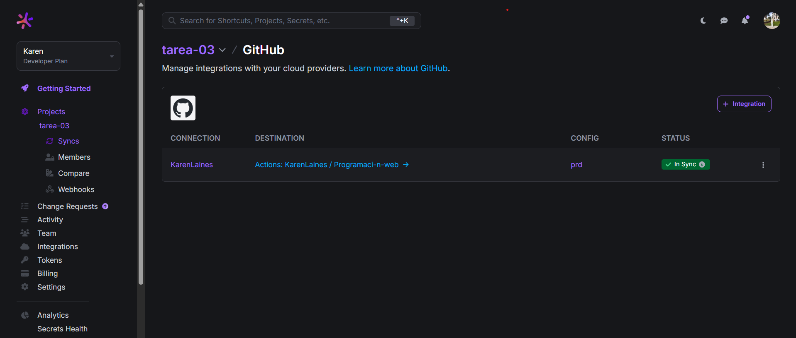
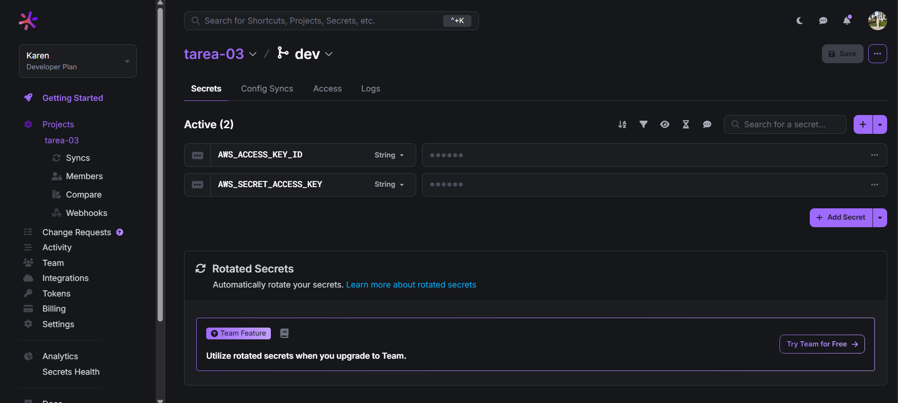
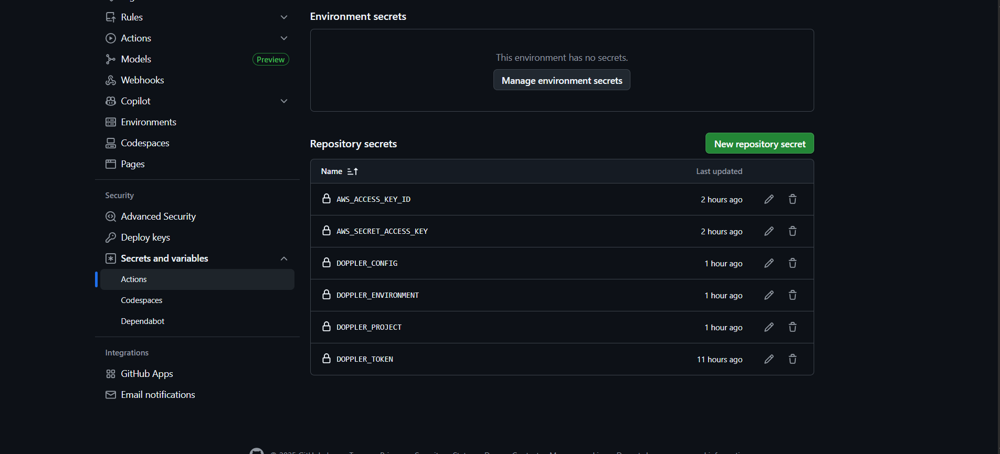

# Programaci-n-web
En este repositorio se realizarán cada uno de los ejercicios de programación web, haciendo una rama por cada ejercicio, hacinendo uso de la correcta utilización de los commits

### URL de la aplicación
[Mi proyecto en CloudFront](http://tarea-03-karen.s3-website.us-east-2.amazonaws.com)

# CAPTURAS DE PANTALLA
### Doppler Config Syncs

### Doppler Variables

### GitHub Secrets

